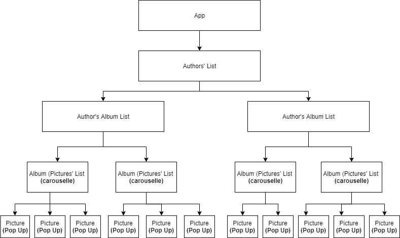

# Photo-gallery

This web application displays the list of photographers, allows you to explore their photo albums and have a closer look o the photos. 
The application is front-end only.

## Deployed version of the app

https://unehirondelle.github.io/photo-gallery/

## Run the application locally

1. Make sure you have **node.js** and **npm** installed
2. Download the project
3. From the root directory type `npm i` to install all the dependancies from package.json
4. Type `npm start` to activate the application
5. Once done the browser window with the application should be automatically opened. If no - go to http://localhost:3000/
6. Each photographer, album thumbnail, and pictures are clickable and allow navigation through the app.
7. After clicking the interested picture you can have a closer look via the carousel.

## Run tests

1. Make sure you have **yarn** installed
2. Type `yarn test` to run tests execution, press `a` to run all tests

Tests cover all the components of the application are rendered as expected.

## Technologies/frameworks used:

1. ReactJS - main framework to build the application
2. CSS - style personalization
3. Jest - tests

## Components structure

